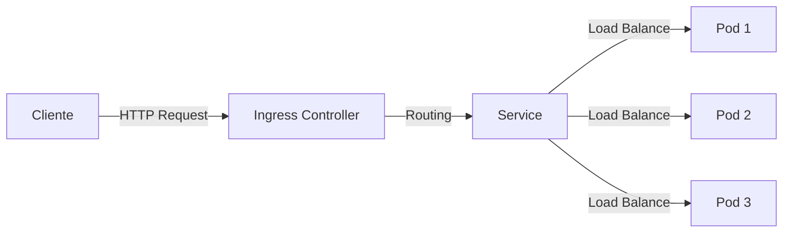
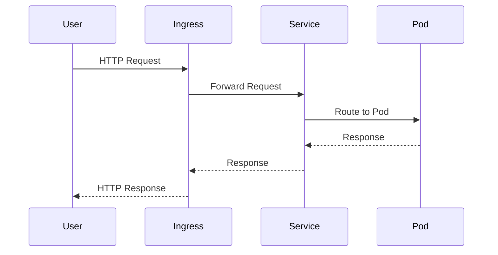

# Guia de Estilo e Padrões

Este documento define os padrões de qualidade, estilo e formatação para todo o conteúdo do **Workshop AKS para Caixa Econômica Federal**.

## Princípios Gerais

### Clareza
O conteúdo deve ser **claro** e **compreensível** para diferentes níveis de experiência (iniciante, intermediário, sênior). Use progressão gradual de complexidade.

### Precisão Técnica
Todas as informações devem ser **tecnicamente precisas** e baseadas em documentação oficial da Microsoft/Azure ou fontes confiáveis.

### Reprodutibilidade
Exemplos, comandos e labs devem ser **reproduzíveis** em ambientes reais. Evite dependências implícitas ou configurações não documentadas.

### Consistência
Mantenha **consistência** em nomenclatura, formatação, estrutura e estilo em todo o repositório.

---

## Documentação (Markdown)

### Estrutura de Arquivos

Todos os arquivos Markdown devem seguir esta estrutura:

```markdown
# Título Principal (H1)

Breve introdução ao tópico (1-2 parágrafos).

## Seção Principal (H2)

Conteúdo da seção...

### Subseção (H3)

Detalhes específicos...

#### Subsubseção (H4)

Use apenas quando necessário para hierarquia profunda.

## Referências

- [Link para documentação oficial](URL)
```

### Formatação

**Negrito:** Use para **termos importantes**, **conceitos-chave** ou **ênfase**.

*Itálico:* Use para *nomes de arquivos*, *variáveis* ou *termos técnicos* em primeira menção.

`Código inline:` Use para `comandos`, `nomes de recursos`, `variáveis` ou `valores`.

**Blocos de código:**
```bash
# Sempre especifique a linguagem
kubectl get pods -n kube-system
```

**Citações:**
> Use para destacar definições, citações ou notas importantes.

**Listas:**
- Use listas não ordenadas para itens sem sequência específica
- Mantenha consistência na pontuação (com ou sem ponto final)
- Não misture estilos de lista no mesmo documento

**Listas ordenadas:**
1. Use para passos sequenciais
2. Numere corretamente
3. Inclua comandos ou ações específicas

### Tamanho de Arquivos

- **Máximo recomendado:** 300 linhas
- Se ultrapassar, considere dividir em múltiplos arquivos
- Use links internos para conectar arquivos relacionados

### Links

**Internos:**
```markdown
[Veja o cenário de DNS](troubleshooting/dns.md)
```

**Externos:**
```markdown
[Documentação oficial do AKS](https://learn.microsoft.com/azure/aks/)
```

### Analogias

Use **analogias claras** para explicar conceitos complexos:

**Exemplo:**
> O CoreDNS funciona como uma "lista telefônica interna" do cluster, traduzindo nomes de serviços em endereços IP.

---

## Comandos e Exemplos

### Formato de Comandos

Sempre inclua:
1. **Contexto** (o que o comando faz)
2. **Comando** (em bloco de código)
3. **Output esperado** (exemplo real ou simulado)

**Exemplo:**

Verificar o status dos pods do CoreDNS:

```bash
kubectl get pods -n kube-system -l k8s-app=kube-dns
```

**Saída esperada:**
```
NAME                       READY   STATUS    RESTARTS   AGE
coredns-789d4bf8c6-4xq2m   1/1     Running   0          5d
coredns-789d4bf8c6-9k7tn   1/1     Running   0          5d
```

### Variáveis em Comandos

Use placeholders claros:

```bash
kubectl logs -f <NOME-DO-POD> -n <NAMESPACE>
```

Ou defina variáveis explicitamente:

```bash
POD_NAME="nginx-deployment-7d8f6d9c8b-5x2kp"
kubectl logs -f $POD_NAME
```

---

## Scripts

### Cabeçalho

Todo script deve começar com:

```bash
#!/bin/bash
#
# Nome: create-aks-cluster.sh
# Descrição: Provisiona um cluster AKS com add-ons gerenciados
# Autor: Workshop AKS - Caixa Econômica Federal
# Data: 2025-10-17
#

set -euo pipefail  # Fail fast
```

### Variáveis

```bash
# Constantes em UPPER_CASE
RESOURCE_GROUP="aks-workshop-rg"
LOCATION="eastus"

# Variáveis em snake_case
cluster_name="aks-workshop-cluster"
node_count=3
```

### Comentários

```bash
# Comentários explicam o "porquê", não o "o quê"

# Criar grupo de recursos para isolar recursos do workshop
az group create --name $RESOURCE_GROUP --location $LOCATION
```

### Validação de Pré-requisitos

```bash
# Verificar se Azure CLI está instalado
if ! command -v az &> /dev/null; then
    echo "Erro: Azure CLI não está instalado."
    exit 1
fi

# Verificar se está logado no Azure
if ! az account show &> /dev/null; then
    echo "Erro: Não está autenticado no Azure. Execute 'az login'."
    exit 1
fi
```

### Mensagens de Progresso

```bash
echo "=========================================="
echo "Criando cluster AKS..."
echo "=========================================="

az aks create \
    --resource-group $RESOURCE_GROUP \
    --name $CLUSTER_NAME \
    --node-count $NODE_COUNT

echo "✅ Cluster criado com sucesso!"
```

### Tratamento de Erros

```bash
if ! az aks create --resource-group $RG --name $CLUSTER; then
    echo "❌ Erro ao criar cluster AKS."
    echo "Verifique os logs acima para mais detalhes."
    exit 1
fi
```

---

## Manifestos Kubernetes (YAML)

### Formatação

```yaml
apiVersion: apps/v1
kind: Deployment
metadata:
  name: nginx-deployment
  namespace: default
  labels:
    app: nginx
    environment: production
  annotations:
    description: "Deployment NGINX para workshop AKS"
spec:
  replicas: 3
  selector:
    matchLabels:
      app: nginx
  template:
    metadata:
      labels:
        app: nginx
    spec:
      containers:
      - name: nginx
        image: nginx:1.25
        ports:
        - containerPort: 80
          name: http
        resources:
          requests:
            cpu: 100m
            memory: 128Mi
          limits:
            cpu: 200m
            memory: 256Mi
```

### Comentários

```yaml
apiVersion: v1
kind: Service
metadata:
  name: nginx-service
spec:
  type: LoadBalancer  # Expõe o serviço externamente via Azure Load Balancer
  selector:
    app: nginx
  ports:
  - port: 80
    targetPort: 80
    protocol: TCP
```

### Best Practices

- Sempre defina **resources** (requests e limits)
- Use **labels** consistentes
- Inclua **annotations** descritivas
- Especifique **versões de imagem** (evite `latest`)
- Use **namespaces** apropriados

---

## Diagramas Mermaid

### Fluxogramas



### Diagramas de Sequência



### Padrões

- Use **cores consistentes** (se aplicável)
- Mantenha **simplicidade** e **clareza**
- Adicione **legendas** quando necessário
- Teste no [Mermaid Live Editor](https://mermaid.live/)

---

## Nomenclatura

### Arquivos e Diretórios

- **Markdown:** `kebab-case.md` (ex: `dns-failure.md`)
- **Scripts:** `kebab-case.sh` (ex: `create-cluster.sh`)
- **YAML:** `kebab-case.yaml` (ex: `nginx-deployment.yaml`)
- **Diretórios:** `kebab-case/` (ex: `troubleshooting/`)

### Recursos Kubernetes

```yaml
# Deployments
nginx-deployment

# Services
nginx-service

# ConfigMaps
app-config

# Secrets
db-credentials

# Namespaces
production
staging
```

### Recursos Azure

```bash
# Grupos de Recursos
aks-workshop-rg

# Clusters AKS
aks-caixa-prod
aks-caixa-staging

# ACR
akscaixaprodacr

# VNets
vnet-aks-prod
```

---

## Progressão de Conteúdo

### Iniciante → Intermediário → Sênior

**Iniciante:**
- Explicações detalhadas
- Analogias simples
- Comandos passo a passo
- Outputs completos

**Intermediário:**
- Conceitos mais avançados
- Menos explicações básicas
- Foco em troubleshooting
- Cenários práticos

**Sênior:**
- Arquitetura profunda
- Otimizações avançadas
- Troubleshooting complexo
- Best practices de produção

---

## Referências

Sempre referencie fontes oficiais:

- [Documentação oficial do AKS](https://learn.microsoft.com/azure/aks/)
- [Kubernetes Documentation](https://kubernetes.io/docs/)
- [Azure Architecture Center](https://learn.microsoft.com/azure/architecture/)
- [AKS Best Practices](https://learn.microsoft.com/azure/aks/best-practices)

---

## Checklist de Qualidade

Antes de submeter conteúdo, verifique:

- [ ] Markdown válido e bem formatado
- [ ] Comandos testados e funcionais
- [ ] Outputs esperados incluídos
- [ ] Diagramas claros e corretos
- [ ] Links funcionando
- [ ] Nomenclatura consistente
- [ ] Sem erros de ortografia
- [ ] Referências oficiais incluídas
- [ ] Analogias claras (quando aplicável)
- [ ] Arquivo ≤ 300 linhas

---

**Mantenha este guia como referência ao criar ou atualizar conteúdo!**

