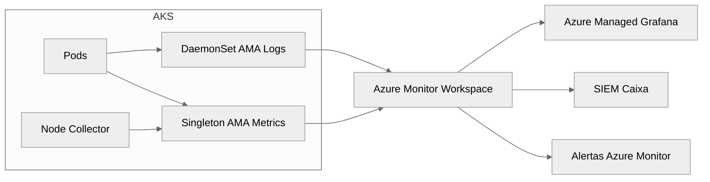

# Monitoramento do AKS com Azure Monitor e Prometheus Gerenciado

## Objetivo
Estabelecer uma arquitetura de observabilidade consistente para clusters AKS da Caixa Econômica Federal, combinando Azure Monitor, Prometheus gerenciado e integrações com sistemas corporativos.

## Visão Geral do Pipeline


- **Singleton AMA Metrics**: coleta métricas cluster-wide segundo configurações dos ConfigMaps listados abaixo.
- **DaemonSet AMA Logs**: envia logs de contêiner, eventos do Kubernetes e métricas de volume.
- **Azure Managed Grafana**: consulta o workspace para dashboards em tempo real.
- **SIEM Caixa**: integra via exportação para eventos críticos (PCI, Bacen, LGPD).

## Configuração dos Agentes

### Habilitando o add-on
```bash
az aks update \
  --resource-group rg-aks-caixa-trn \
  --name aks-caixa-trn \
  --enable-azure-monitor-metrics \
  --enable-managed-prometheus
```

### Principais ConfigMaps (namespace `kube-system`)
1. `ama-metrics-settings-configmap`
2. `ama-metrics-prometheus-config`
3. `ama-metrics-prometheus-config-node`
4. `ama-metrics-prometheus-config-node-windows`

> Ajuste os ConfigMaps via `kubectl apply -f` e acompanhe reinício dos pods `ama-metrics`.

#### Exemplo: `ama-metrics-settings-configmap`
```yaml
apiVersion: v1
kind: ConfigMap
metadata:
  name: ama-metrics-settings-configmap
  namespace: kube-system
data:
  cluster_alias: "aks-caixa-prod"
  scrape_interval: "30s"
  enable_default_collection: "true"
  namespace_keep_list: "kube-system,ingress-nginx,financeiro,pagamentos"
  enable_node_level: "true"
  debug_mode: "false"
```

#### Exemplo: `ama-metrics-prometheus-config`
```yaml
apiVersion: v1
kind: ConfigMap
metadata:
  name: ama-metrics-prometheus-config
  namespace: kube-system
data:
  prometheus-config: |
    scrape_configs:
      - job_name: 'kube-state-metrics'
        static_configs:
          - targets: ['kube-state-metrics.kube-system.svc.cluster.local:8080']
      - job_name: 'ingress-nginx'
        kubernetes_sd_configs:
          - role: pod
        relabel_configs:
          - source_labels: [__meta_kubernetes_pod_label_app_kubernetes_io_name]
            regex: ingress-nginx
            action: keep
```

#### Exemplo: `ama-metrics-prometheus-config-node`
```yaml
apiVersion: v1
kind: ConfigMap
metadata:
  name: ama-metrics-prometheus-config-node
  namespace: kube-system
data:
  prometheus-config: |
    scrape_configs:
      - job_name: 'node-exporter'
        static_configs:
          - targets: ["${NODE_IP}:9100"]
```

### Autenticação (mTLS e headers)
```yaml
apiVersion: v1
kind: Secret
metadata:
  name: ama-metrics-mtls-secret
  namespace: kube-system
type: Opaque
data:
  ca.crt: <base64>
  tls.crt: <base64>
  tls.key: <base64>
  basic_auth: <base64 user:password>
  bearer_token: <base64 token>
```

Monte o Secret em `/etc/config/ssl/` usando `volumeMounts` nos pods do agente. Para autenticação via bearer token, atualize o ConfigMap com o bloco `authorization` seguindo a documentação oficial.

### Coleta de Logs (Container Insights)
```yaml
apiVersion: v1
kind: ConfigMap
metadata:
  name: container-azm-ms-agentconfig
  namespace: kube-system
data:
  schema-version: v1
  config-version: 1.0
  log-data-collection-settings: |
    {
      "stdout": {"enabled": true},
      "stderr": {"enabled": true},
      "namespaceFiltering": {
        "allow": ["financeiro","pagamentos","kube-system"],
        "deny": ["default","dev-temporario"]
      },
      "annotationExclusion": {
        "key": "fluentbit.io/exclude",
        "value": "true"
      },
      "enableContainerEnvironmentCollection": true,
      "enableKubeEvents": true,
      "kubeEventsIncludeNormal": true,
      "collectPersistentVolumeMetrics": true,
      "logCollectionType": "ContainerLogV2"
    }
```

> Se Data Collection Rules (DCR) estiverem habilitadas, elas prevalecem sobre o ConfigMap.

## Troubleshooting

| Sintoma | Diagnóstico | Comandos | Ação |
|---------|-------------|----------|------|
| Métricas não aparecem no Grafana | Pods `ama-metrics` em CrashLoop ou ConfigMap inválido | `kubectl logs -n kube-system deploy/ama-metrics-operator`<br>`kubectl describe cm ama-metrics-settings-configmap` | Corrigir sintaxe YAML, validar permissões RBAC.
| Gaps nas métricas de nodes | Node Collector sem acesso ao kubelet | `kubectl logs -n kube-system ds/ama-metrics-node` | Garantir `hostNetwork: true`, validar portas 10250/10255.
| Cardinalidade alta | Labels dinâmicos em métricas custom | `kubectl logs -n kube-system deploy/ama-metrics-operator | rg 'cardinality'` | Normalizar labels, usar `metric_relabel_configs`.
| Lag em logs | CPU alta no DaemonSet | `kubectl top pod -n kube-system | grep ama-logs` | Aumentar recursos, escalonar DaemonSet, revisar volume de logs.
| Falha TLS | Secret inválido | `kubectl describe secret ama-metrics-mtls-secret` | Regenerar certificado e reiniciar pods.

## Métricas Prioritárias
- **Saturação IPs**: `pod_allocated_ips / pod_capacity_ips` (alerta > 0.75).
- **Latência DNS**: `kubedns_dns_request_duration_seconds` p95 > 150ms.
- **Erros AGIC**: `appgw_total_requests` vs `appgw_failed_requests`, correlacionar com `backend_connectivity_failures`.
- **KEDA**: `keda_scaled_object_failed_reconcile` e `keda_metrics_adapter_scaled_objects`.
- **Volumes**: `kube_persistentvolumeclaim_status_phase` != `Bound` por mais de 5 minutos.
- **SNAT**: `SNATPortUtilization` em Load Balancer/NAT Gateway > 70% por 5 minutos.

## Integrações
- **Grafana**: configure data source `Azure Monitor` e utilize dashboards em `dashboards_alerts/`.
- **SIEM Caixa**: exporte logs críticos via `Diagnostic Settings` para Event Hub/Log Analytics.
- **Alertas**: defina Action Groups alinhados ao NOC Caixa e configure notificações via Teams/Email.

## Laboratório Relacionado
- `labs/02-managed-prometheus-grafana`: guia passo a passo para habilitar a coleta e importar dashboards.

## Referências Oficiais
- [Azure Monitor managed service for Prometheus](https://learn.microsoft.com/azure/azure-monitor/essentials/prometheus-overview)
- [Configure AMA metrics in AKS](https://learn.microsoft.com/azure/aks/monitor-azure-monitor-metrics)
- [Container insights data collection](https://learn.microsoft.com/azure/azure-monitor/containers/container-insights-agent-config)
