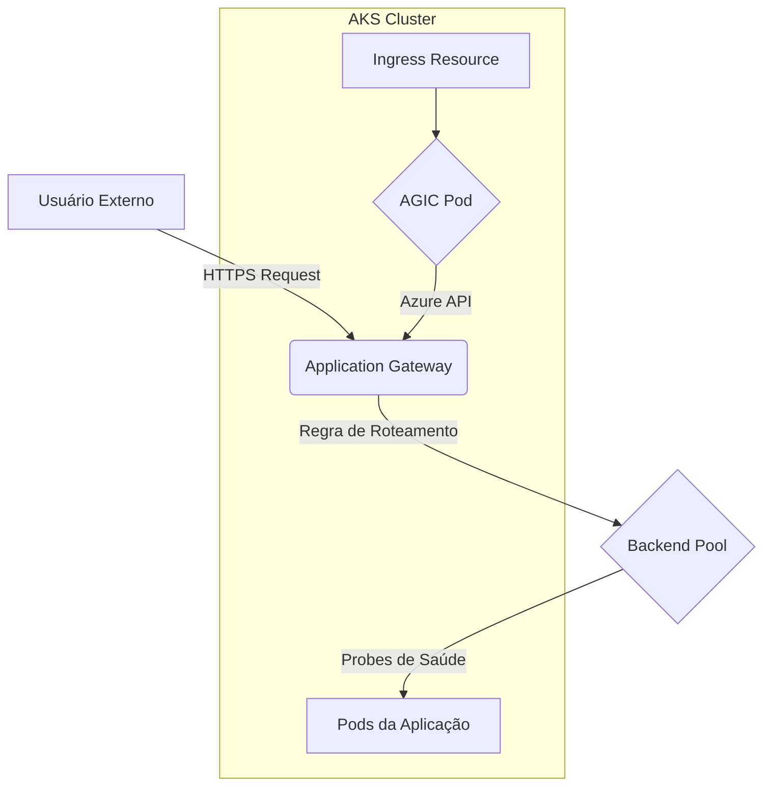

> [!NOTE]
> This is a placeholder for the full content. The final version will be more detailed.

# Cenário de Troubleshooting: Problemas com AGIC (Application Gateway Ingress Controller)

**Nível:** Avançado  
**Duração:** 60 minutos

---

## 🎯 Objetivo

Diagnosticar e resolver problemas comuns com o **Application Gateway Ingress Controller (AGIC)**, onde o tráfego externo não chega às aplicações no AKS ou o roteamento falha.

---

## 🚨 Sintomas Comuns

- **HTTP 502 Bad Gateway:** O Application Gateway não consegue alcançar os back-ends (pods).
- **HTTP 404 Not Found:** A regra de roteamento está incorreta.
- **Alterações no Ingress não são refletidas:** O AGIC não está sincronizando a configuração.
- **Back-ends não saudáveis:** Os pods são marcados como "Unhealthy" no Application Gateway.

---

## 🎨 Diagrama do Fluxo AGIC



---

## 🛠️ Playbook de Diagnóstico e Resolução

### Passo 1: Verificar Logs do AGIC

```bash
kubectl logs -l app=ingress-azure -n kube-system
```

### Passo 2: Inspecionar o Recurso Ingress

```bash
kubectl describe ingress <NOME-DO-INGRESS>
```

### Passo 3: Verificar a Configuração do Application Gateway

- **Backend Pools:** Verifique se os IPs dos pods estão corretos.
- **Health Probes:** Verifique se as probes estão configuradas corretamente e se os pods estão respondendo.
- **Listeners e Rules:** Garanta que as regras de roteamento correspondem ao Ingress.

### Passo 4: Validar Conectividade Pod-para-Pod e Probes

- Use um pod de teste para tentar acessar o endpoint da sua aplicação diretamente, usando o IP do pod.

---

## 🧪 Lab Prático: Simulando um 502 Bad Gateway

1.  **Deploy de uma aplicação com probe de saúde incorreta.**
2.  **Observar o erro 502.**
3.  **Diagnosticar usando os logs do AGIC e o status do Application Gateway.**
4.  **Corrigir a probe de saúde no manifesto do Deployment.**
5.  **Validar que o tráfego é restaurado.**

---

## 🛡️ Boas Práticas e Prevenção

- **Use Probes de Saúde (Readiness Probes):** Sempre configure readiness probes para que o AGIC saiba quando um pod está pronto para receber tráfego.
- **Monitore o Application Gateway:** Use as métricas do Azure Monitor para o Application Gateway.
- **Anote corretamente:** Use as anotações corretas do AGIC para customizar o comportamento.

---

## 📚 Referências

- [1] **Microsoft Learn:** [Troubleshooting Application Gateway Ingress Controller](https://learn.microsoft.com/azure/application-gateway/ingress-controller-troubleshoot)
- [2] **GitHub:** [AGIC Annotations](https://github.com/Azure/application-gateway-kubernetes-ingress/blob/master/docs/annotations.md)

