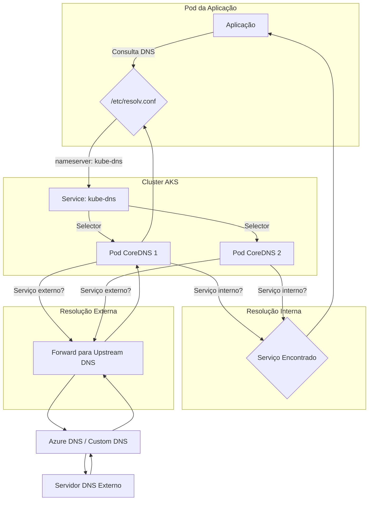

# Cenário de Troubleshooting: Falhas de DNS Interno

**Nível:** Intermediário  
**Duração:** 45 minutos

---

## 🎯 Objetivo

Diagnosticar e resolver problemas de resolução de DNS em um cluster AKS, onde aplicações não conseguem se comunicar com outros serviços (internos ou externos) devido a falhas na resolução de nomes.

---

## 🚨 Sintomas Comuns

Os sintomas de falhas de DNS podem se manifestar de várias formas, geralmente resultando em erros de conectividade. É crucial identificar os sinais corretos para um diagnóstico preciso.

### Erros em Logs de Aplicação

O sintoma mais comum é a incapacidade da aplicação de se conectar a um serviço, resultando em erros de "host desconhecido".

**Exemplo em uma aplicação Python:**
```log
urllib3.exceptions.NameResolutionError: <urllib3.connection.HTTPConnection object at 0x7f3e6c1d3a90>: Failed to resolve 'meu-servico-backend' (Name or service not known)
```

**Exemplo em uma aplicação Java:**
```log
java.net.UnknownHostException: meu-servico-backend: Name or service not known
```

### Erros em Comandos `curl` ou `ping`

Ao executar comandos de teste de conectividade de dentro de um pod, você pode observar os seguintes erros:

```bash
# Testando de dentro de um pod de diagnóstico
/ # curl http://meu-servico-backend
curl: (6) Could not resolve host: meu-servico-backend

/ # ping google.com
ping: bad address 'google.com'
```

### Eventos de Pods

Em alguns casos, falhas de DNS podem impedir que um pod inicie corretamente se ele depender da resolução de nomes durante a inicialização (ex: para se conectar a um banco de dados).

```bash
kubectl get events --field-selector involvedObject.name=<NOME-DO-POD>
```

**Saída esperada (exemplo):**
```
LAST SEEN   TYPE      REASON      OBJECT                     MESSAGE
3m4s        Warning   Failed      pod/minha-app-7f8c9d...    Error: failed to resolve db.meu-banco.com
```

### Métricas do CoreDNS

Se você estiver monitorando o CoreDNS com Prometheus, pode observar um aumento na taxa de erros ou latência.

- `coredns_dns_responses_total{rcode="NXDOMAIN"}`: Aumento de respostas "Non-Existent Domain".
- `coredns_dns_requests_duration_seconds_sum`: Aumento na latência de resolução.

---

## 🎨 Diagrama do Fluxo de Resolução DNS

Compreender o fluxo de resolução de DNS em um cluster AKS é fundamental para o diagnóstico. O diagrama abaixo ilustra como uma consulta DNS é resolvida, desde o pod da aplicação até o CoreDNS e, potencialmente, para um servidor DNS upstream.



**Explicação do Fluxo:**
1. A aplicação no **Pod A** faz uma consulta DNS.
2. O sistema operacional do pod consulta o arquivo `/etc/resolv.conf` para encontrar o **nameserver**, que aponta para o serviço `kube-dns`.
3. O serviço `kube-dns` faz o balanceamento de carga da requisição para um dos **pods do CoreDNS**.
4. O CoreDNS verifica se a consulta é para um serviço interno do cluster. Se for, ele retorna o ClusterIP do serviço.
5. Se a consulta for para um domínio externo, o CoreDNS a encaminha para um **servidor DNS upstream** (geralmente o DNS do Azure ou um DNS customizado configurado na VNet).

---

## 🛠️ Playbook de Diagnóstico e Resolução

Siga este playbook passo a passo para diagnosticar e resolver problemas de DNS de forma sistemática.

### Passo 1: Validar o Status do CoreDNS

O primeiro passo é garantir que o CoreDNS, o coração do sistema de DNS do cluster, está saudável.

**Comando:**
```bash
kubectl get pods -n kube-system -l k8s-app=kube-dns -o wide
```

**O que procurar:**
- **STATUS:** Todos os pods devem estar `Running`.
- **READY:** A contagem deve ser `1/1`.
- **RESTARTS:** Um número alto de reinicializações pode indicar um problema crônico.
- **NODE:** Verifique se os pods estão distribuídos em diferentes nós para alta disponibilidade.

**Se houver problemas:**
- **Pods em `Pending`:** Pode indicar falta de recursos no cluster. Use `kubectl describe pod <NOME-DO-POD-COREDNS> -n kube-system` para ver os eventos.
- **Pods em `CrashLoopBackOff`:** Verifique os logs para entender a causa da falha.

**Comando para verificar logs:**
```bash
# Verifique os logs de um pod específico
kubectl logs <NOME-DO-POD-COREDNS> -n kube-system

# Siga os logs em tempo real
kubectl logs -f <NOME-DO-POD-COREDNS> -n kube-system
```

### Passo 2: Testar a Resolução de DNS de Dentro do Cluster

Crie um pod de diagnóstico para testar a resolução de nomes diretamente do ambiente do cluster.

**Comando para criar pod de teste:**
```bash
kubectl run dns-test --image=mcr.microsoft.com/mirror/docker/library/busybox:1.28 --rm -it --restart=Never -- sh
```

**Dentro do pod de teste, execute os seguintes comandos:**

1. **Verifique `/etc/resolv.conf`:**
   ```sh
   cat /etc/resolv.conf
   ```
   **Saída esperada:**
   ```
   nameserver 10.0.0.10  # IP do serviço kube-dns
   search default.svc.cluster.local svc.cluster.local cluster.local
   options ndots:5
   ```
   - O `nameserver` **DEVE** ser o IP do serviço `kube-dns`.

2. **Teste a resolução de um serviço interno:**
   ```sh
   nslookup kubernetes.default
   ```
   **Saída esperada:**
   ```
   Server:    10.0.0.10
   Address 1: 10.0.0.10 kube-dns.kube-system.svc.cluster.local

   Name:      kubernetes.default
   Address 1: 10.0.0.1 kubernetes.default.svc.cluster.local
   ```

3. **Teste a resolução de um serviço externo:**
   ```sh
   nslookup www.google.com
   ```
   **Saída esperada:**
   ```
   Server:    10.0.0.10
   Address 1: 10.0.0.10 kube-dns.kube-system.svc.cluster.local

   Name:      www.google.com
   Address 1: 142.250.218.36 lga25s79-in-f4.1e100.net
   ... (outros endereços)
   ```

**Se os testes falharem:**
- **Falha no `nslookup kubernetes.default`:** O problema está na comunicação com o CoreDNS ou no próprio CoreDNS.
- **Falha no `nslookup www.google.com` (mas o interno funciona):** O problema está no encaminhamento do CoreDNS para o DNS upstream ou em regras de firewall/NSG que bloqueiam o tráfego DNS de saída.

### Passo 3: Verificar o Serviço `kube-dns`

Garanta que o serviço que expõe o CoreDNS está configurado corretamente.

**Comando:**
```bash
kubectl get svc kube-dns -n kube-system
```

**Saída esperada:**
```
NAME       TYPE        CLUSTER-IP   EXTERNAL-IP   PORT(S)                  AGE
kube-dns   ClusterIP   10.0.0.10    <none>        53/UDP,53/TCP,9153/TCP   120d
```
- O `CLUSTER-IP` **DEVE** corresponder ao `nameserver` no `/etc/resolv.conf` dos pods.

### Passo 4: Verificar Network Policies

Políticas de rede restritivas podem bloquear o tráfego DNS. Verifique se existem políticas que impedem a comunicação com o CoreDNS na porta 53 (UDP/TCP).

**Comando para listar políticas:**
```bash
kubectl get networkpolicy --all-namespaces
```

**O que procurar:**
- Políticas que selecionam os pods do CoreDNS (`k8s-app=kube-dns`) ou os pods da sua aplicação.
- Regras de `egress` (saída) nos pods da aplicação que não permitem tráfego para o namespace `kube-system` na porta 53.
- Regras de `ingress` (entrada) no namespace `kube-system` que não permitem tráfego dos pods da aplicação.

**Exemplo de política de rede que permite DNS:**
```yaml
apiVersion: networking.k8s.io/v1
kind: NetworkPolicy
metadata:
  name: allow-dns-access
  namespace: meu-namespace
spec:
  podSelector: {}
  egress:
  - to:
    - namespaceSelector:
        matchLabels:
          kubernetes.io/metadata.name: kube-system
      podSelector:
        matchLabels:
          k8s-app: kube-dns
    ports:
    - port: 53
      protocol: UDP
    - port: 53
      protocol: TCP
```

### Passo 5: Reiniciar os Pods do CoreDNS (Como Último Recurso)

Se todas as verificações acima não resolverem o problema, reiniciar os pods do CoreDNS pode forçar uma nova configuração e resolver estados inconsistentes. **Atenção:** Isso causará uma breve interrupção na resolução de DNS.

**Comando:**
```bash
kubectl delete pods -n kube-system -l k8s-app=kube-dns
```

O Kubernetes irá recriar os pods automaticamente. Monitore o status deles até que estejam `Running` e `Ready` novamente.

---

## 🧪 Lab Prático: Simulando e Resolvendo uma Falha de DNS

Neste lab, vamos simular uma falha de DNS aplicando uma política de rede restritiva e, em seguida, diagnosticar e resolver o problema.

### 1. Preparar o Ambiente

Crie um pod de aplicação que tenta se comunicar com um serviço externo.

```yaml
# dns-test-app.yaml
apiVersion: v1
kind: Pod
metadata:
  name: dns-test-app
  namespace: default
spec:
  containers:
  - name: busybox
    image: mcr.microsoft.com/mirror/docker/library/busybox:1.28
    command: ['sh', '-c', 'while true; do nslookup www.google.com; sleep 10; done']
```

**Aplique o manifesto:**
```bash
kubectl apply -f dns-test-app.yaml
```

**Verifique os logs (deve funcionar):**
```bash
kubectl logs -f dns-test-app
```

### 2. Simular a Falha

Aplique uma política de rede que bloqueia todo o tráfego de saída (egress) do namespace `default`.

```yaml
# deny-all-egress.yaml
apiVersion: networking.k8s.io/v1
kind: NetworkPolicy
metadata:
  name: deny-all-egress
  namespace: default
spec:
  podSelector: {}
  policyTypes:
  - Egress
```

**Aplique a política:**
```bash
kubectl apply -f deny-all-egress.yaml
```

### 3. Diagnosticar o Problema

**Verifique os logs do pod `dns-test-app` novamente:**
```bash
kubectl logs -f dns-test-app
```

**Saída esperada (com falha):**
```
Server:    10.0.0.10
Address 1: 10.0.0.10 kube-dns.kube-system.svc.cluster.local

nslookup: can't resolve 'www.google.com'
```

- O `nslookup` agora falha, indicando que o pod não consegue mais se comunicar com o CoreDNS.

### 4. Resolver o Problema

Crie uma política de rede que permita explicitamente o tráfego de saída para o CoreDNS.

```yaml
# allow-dns-egress.yaml
apiVersion: networking.k8s.io/v1
kind: NetworkPolicy
metadata:
  name: allow-dns-egress
  namespace: default
spec:
  podSelector: {}
  policyTypes:
  - Egress
  egress:
  - to:
    - namespaceSelector:
        matchLabels:
          kubernetes.io/metadata.name: kube-system
      podSelector:
        matchLabels:
          k8s-app: kube-dns
    ports:
    - port: 53
      protocol: UDP
```

**Aplique a política de correção:**
```bash
kubectl apply -f allow-dns-egress.yaml
```

### 5. Validar a Solução

**Verifique os logs do pod `dns-test-app` mais uma vez:**
```bash
kubectl logs -f dns-test-app
```

- A resolução de nomes para `www.google.com` deve voltar a funcionar.

### 6. Limpeza

```bash
kubectl delete pod dns-test-app
kubectl delete networkpolicy deny-all-egress
kubectl delete networkpolicy allow-dns-egress
```

---

## 🛡️ Boas Práticas e Prevenção

- **Monitore o CoreDNS:** Use o Azure Monitor for containers ou Prometheus para monitorar a saúde, latência e taxa de erros dos pods do CoreDNS.
- **Use Network Policies com Cuidado:** Ao implementar políticas de rede, sempre inclua uma regra explícita para permitir o tráfego DNS (porta 53/UDP) para o namespace `kube-system`.
- **Configure `dnsConfig` em Pods:** Para aplicações com requisitos de DNS específicos, use o campo `dnsConfig` no manifesto do Pod para customizar o `resolv.conf`.
- **Use FQDNs:** Em ambientes de produção, use nomes de serviço FQDN (Fully Qualified Domain Name) para evitar ambiguidades (ex: `meu-servico.meu-namespace.svc.cluster.local`).
- **Considere Node Local DNS Cache:** Para clusters com alta densidade de pods e muitas consultas DNS, habilitar o [Node Local DNS Cache](https://learn.microsoft.com/azure/aks/node-local-dns) pode melhorar a performance e a confiabilidade.

---

## 📚 Referências

- [1] **Microsoft Learn:** [Troubleshoot DNS resolution in Azure Kubernetes Service (AKS)](https://learn.microsoft.com/azure/aks/troubleshooting-dns-resolution)
- [2] **Kubernetes Documentation:** [Debugging DNS Resolution](https://kubernetes.io/docs/tasks/administer-cluster/dns-debugging-resolution/)
- [3] **Kubernetes Documentation:** [Network Policies](https://kubernetes.io/docs/concepts/services-networking/network-policies/)
- [4] **Microsoft Learn:** [Secure traffic between pods using network policies in Azure Kubernetes Service (AKS)](https://learn.microsoft.com/azure/aks/use-network-policies)
- [5] **CoreDNS Website:** [CoreDNS Homepage](https://coredns.io/)

