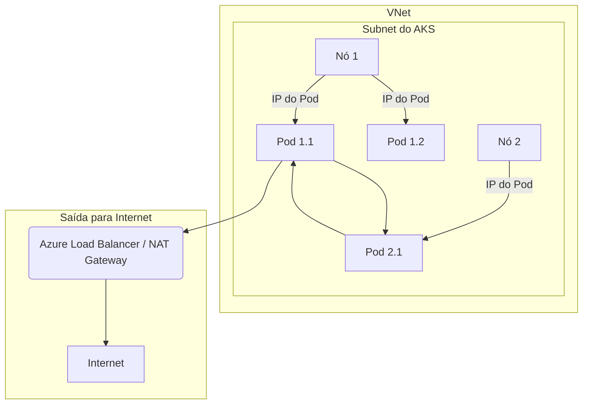

> [!NOTE]
> This is a placeholder for the full content. The final version will be more detailed.

# Cenário de Troubleshooting: Conectividade com Azure CNI

**Nível:** Avançado  
**Duração:** 75 minutos

---

## 🎯 Objetivo

Diagnosticar e resolver problemas de conectividade de rede em clusters AKS que utilizam o **Azure CNI**, incluindo esgotamento de IPs, problemas de SNAT e comunicação entre pods e com serviços externos.

---

## 🚨 Sintomas Comuns

- **Pods em `ContainerCreating` ou `Failed`:** Pods não conseguem iniciar devido à falha na alocação de IPs.
- **Falha na comunicação Pod-para-Pod:** Pods no mesmo nó ou em nós diferentes não conseguem se comunicar.
- **Falha na comunicação com a internet:** Pods não conseguem acessar recursos externos (ex: APIs públicas).
- **Esgotamento de portas SNAT:** Conexões de saída falham intermitentemente.

---

## 🎨 Diagrama do Fluxo de Rede com Azure CNI



---

## 🛠️ Playbook de Diagnóstico e Resolução

### Passo 1: Verificar a Utilização de IPs na Subnet

- Use o portal do Azure ou a CLI para verificar quantos IPs estão disponíveis na subnet do AKS.

### Passo 2: Inspecionar os Nós do AKS

```bash
kubectl describe node <NOME-DO-NO>
```

- Verifique a seção `Allocatable` para `pods` e a contagem de IPs alocados.

### Passo 3: Verificar Logs do Azure CNI

- Conecte-se a um nó e verifique os logs do daemonset do Azure CNI.

### Passo 4: Diagnosticar Problemas de SNAT

- Verifique as métricas do Load Balancer para `SNAT Connection Count`.
- Considere o uso de um **NAT Gateway** para mitigar o esgotamento de portas SNAT.

---

## 🧪 Lab Prático: Simulando Esgotamento de IPs

1.  **Criar um cluster com uma subnet pequena.**
2.  **Fazer o deploy de um grande número de pods.**
3.  **Observar que alguns pods ficam em estado `Pending` ou `ContainerCreating`.**
4.  **Diagnosticar usando `kubectl describe pod` e verificando a disponibilidade de IPs na subnet.**
5.  **Resolver o problema aumentando o espaço de endereçamento da subnet ou usando o Azure CNI Overlay.**

---

## 🛡️ Boas Práticas e Prevenção

- **Planeje sua VNet:** Calcule o número de IPs necessários com base no `maxPods` por nó e no número máximo de nós.
- **Use Azure CNI Overlay:** Para clusters grandes, o modo Overlay pode economizar um número significativo de IPs da VNet.
- **Use um NAT Gateway:** Para cargas de trabalho com muitas conexões de saída, um NAT Gateway é a solução recomendada para evitar o esgotamento de SNAT.

---

## 📚 Referências

- [1] **Microsoft Learn:** [Configure Azure CNI networking in AKS](https://learn.microsoft.com/azure/aks/configure-azure-cni)
- [2] **Microsoft Learn:** [Troubleshoot Azure CNI networking](https://learn.microsoft.com/azure/aks/cni-azure-troubleshoot)
- [3] **Microsoft Learn:** [Use a NAT gateway with an AKS cluster](https://learn.microsoft.com/azure/aks/nat-gateway)

