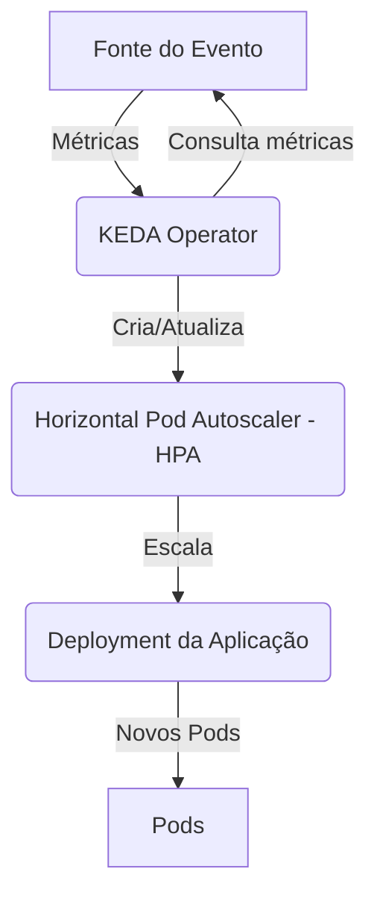

> [!NOTE]
> This is a placeholder for the full content. The final version will be more detailed.

# Cenário de Troubleshooting: KEDA não escalando

**Nível:** Avançado  
**Duração:** 60 minutos

---

## 🎯 Objetivo

Diagnosticar e resolver problemas onde o **KEDA (Kubernetes Event-driven Autoscaling)** não escala os pods de uma aplicação conforme o esperado, com base em triggers como filas de mensagens ou métricas HTTP.

---

## 🚨 Sintomas Comuns

- **Pods não aumentam:** A carga no trigger (ex: mensagens na fila) aumenta, mas o número de pods da aplicação permanece em 0 ou no mínimo.
- **`ScaledObject` com status de erro:** O `ScaledObject` mostra um status de falha.
- **Erros nos logs do KEDA Operator:** O pod do KEDA Operator reporta erros de conexão com a fonte do evento (ex: Azure Service Bus).

---

## 🎨 Diagrama do Fluxo KEDA



---

## 🛠️ Playbook de Diagnóstico e Resolução

### Passo 1: Inspecionar o `ScaledObject`

```bash
kubectl describe scaledobject <NOME-DO-SCALEDOBJECT>
```

- Verifique a seção `Status` e `Events` por mensagens de erro.

### Passo 2: Verificar Logs do KEDA Operator

```bash
kubectl logs -l app=keda-operator -n kube-system
```

- Procure por erros relacionados ao trigger específico (ex: falha de autenticação com o Service Bus).

### Passo 3: Validar a Configuração do Trigger

- **`TriggerAuthentication`:** Garanta que a autenticação com a fonte do evento está correta (ex: connection string, pod identity).
- **Metadados do Trigger:** Verifique se os metadados (ex: `queueName`, `topicName`) estão corretos.

### Passo 4: Verificar o HPA Gerenciado pelo KEDA

```bash
kubectl get hpa
```

- O KEDA cria um HPA. Verifique o status desse HPA e se ele está recebendo as métricas corretamente.

---

## 🧪 Lab Prático: Simulando Falha de Autenticação

1.  **Deploy de um `ScaledObject` com uma `TriggerAuthentication` incorreta.**
2.  **Gerar carga na fila (Azure Service Bus).**
3.  **Observar que a aplicação não escala.**
4.  **Diagnosticar usando `describe scaledobject` e os logs do KEDA Operator.**
5.  **Corrigir a `TriggerAuthentication` com a connection string correta.**
6.  **Validar que a aplicação escala corretamente.**

---

## 🛡️ Boas Práticas e Prevenção

- **Use `TriggerAuthentication`:** Armazene segredos e connection strings em Secrets e referencie-os com `TriggerAuthentication`.
- **Defina `minReplicaCount` e `maxReplicaCount`:** Configure limites de escalonamento para evitar custos inesperados ou sobrecarga.
- **Monitore o KEDA:** Use as métricas do Prometheus expostas pelo KEDA para monitorar a saúde dos `ScaledObjects`.

---

## 📚 Referências

- [1] **KEDA Documentation:** [Troubleshooting KEDA](https://keda.sh/docs/2.10/troubleshooting/)
- [2] **KEDA Documentation:** [Azure Service Bus Trigger](https://keda.sh/docs/2.10/scalers/azure-service-bus/)

